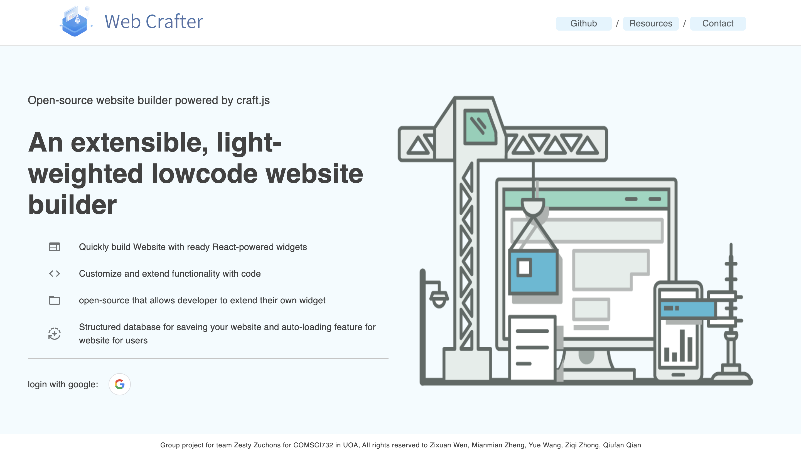
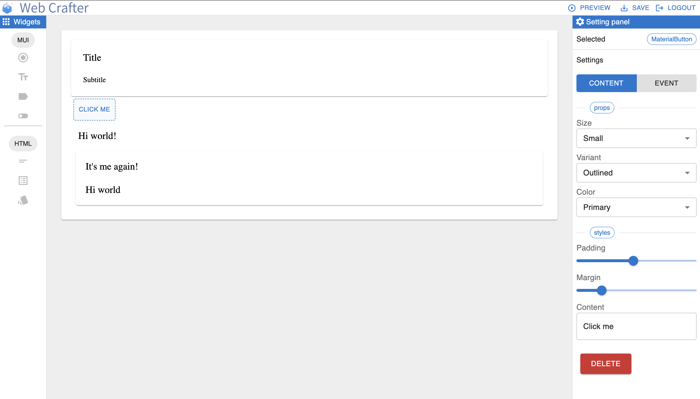

# Web Crafter

<p align="center">
  
  <h1>An extensible lowcode website builder</h1>
  <a href="https://img.shields.io/badge/License-GPLv3-blue.svg">
    
</p>

## Features

Web Crafter is a low-code website building platform aimed to help people who don't know website programing to buildup their own website by drag and drop.
- Login with Google authentication
- Provide basic widgets for user to buildup the website
- Provide flexible drag-and-drop feature for people to add and modify the widget for their webpage in canvas
- Styles and properfies of widget can be modified easily from setting panel
- Modifiable and customizable switch/button/chip for multiple usage.
- support event for some of the widget (e.g: support onclick event on button)
- Auto loading for the canvas if user already saved one


## Tech stacks

The main Tech stacks we are using in this project are listed below:
  - craft.js: An opensource framework for building web builder application
  - material UI: Styling library used for both styling the application and widget in the application
  - vite: light-weighted frontend react CLI
  - node.js: open-source, cross-platform JavaScript runtime environment
  - express: minimal and flexible Node.js web application framework that provides a robust set of features for web and mobile applications
  - Jest: testing framework designed to ensure correctness of any JavaScript codebase
  - Swagger: Dashbord for managing / testing backend APIs


## Running Project

1. Setup nodejs environment.

2. Run the project

```bash
npm run start-all
```

This command will start up frontend and backend at the same time so you don't need to cd to different folder to start them seperately.

Or if you are running the project first time:

```bash
npm run start-all-first-time
```
This command will install all needed package for frontend and backend as well as starting up them at the same time

3. If the command above doesn't work, then you needed to install the packages and start up frontend and backend manually

Run the command below to start frontend
```bash
npm install (only if you are running the project at the first time)
npm run start
```

then cd to `server` folder, run the command below to start backend
```bash
npm install (only if you are running the project at the first time)
node server.js
```

## Tests

Run `npm test` in the project root to execute the unit tests via [Jest](https://jestjs.io).

## Wiki

The wiki can contains all meeting notes and major design decisions, rationale and project management information.

## ScreenShots

<p align="center">
  
  
</p>

## Contributors

- Zixuan Wen (zwen655)
- Mianmian Zheng (mzhe930)
- Ziqi Zhong (zzho500)
- Yue Wang (wany359)
- Qiufan Qian (qqia320)
